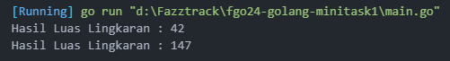

# Go Introduction

In This project i create a Simple calculate the area and circumference of a circle with go languange

## Preview



## How to Run This Project

1. Clone the repository:
   ```bash
   git clone https://github.com/VsalCode/fgo24-go-introduction.git
   ```

2. Navigate to the project folder:
   ```bash
   cd fgo24-go-introduction
   ```

3. Run the program
   ```bash
   go run main.go
   ```

## How to Contribute
Pull requests are welcome! For major changes, please open an issue first to discuss your proposed changes. Ensure tests are updated as needed.

## License
[MIT](https://opensource.org/license/mit)
